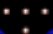
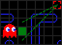
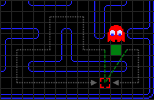

# **CoronaTime**

# **ВСТУП**
Програма є втіленням легендарної гри «Pacman» з персонажами та тематикою стилізованими під COVID-19. Тому така гра зазнає «вірусного» поширення, бо є досить цікавою та захоплюючою щодо геймплею та актуальною через свою тематику.

Головною метою нашого проекту було реалізувати та вдосконалити механізми, використані розробниками оригінальної гри «Pacman» для гри, що дають змогу поринути у світ коронавірусів та позмагатися з ними за життя, втікаючи та захищаючись від них.

Завданням було опрацювати різні джерела, що пов’язані з оригінальною грою, вдосконалити ідеї та реалізувати їх з так, щоб користувач отримав насолоду від гри. На основі здобутих знань по мові програмування С++, додаткових джерел пов’язаних з графічною бібліотекою SFML  та аналізу всебічних джерел  визначити основні складові проекту та структурувати роботу над програмним продуктом.

Практичне використання програми на особистому комп’ютері не потребує використання Інтернету.

Користувач може взаємодіяти з грою через комп’ютер, а точніше через клавіатуру (up, down, left, right, space, escape) та мишу (масштабування віконця, close window і т. п.).

# **РОЗДІЛ 1. ОПИС ДОДАТКУ «CORONATIME»**
«Pacman» — всесвітньо відома комп'ютерна гра, що вперше вийшла в 1979р. в Японії. Назва «Pacman» з'явилася від японського виразу «паку-паку таберу», що означає відкушувати, багаторазово широко розкриваючи рот і закриваючи його. Деякі джерела стверджують, що ідея гри автору прийшла, коли він побачив піцу без одного шматка.

За сюжетом гри — це кругла жовта істота, що складається з рота та очей. Завдання гравця — зібрати всі білі точки на рівні, уникаючи зіткнень з привидами. Рівень закінчується, коли з'їдені всі крапки. На початку рівня привиди знаходяться в центрі екрану в невеликій кімнаті, звідки виходять по одному. Один привид починає рівень поза кімнаткою. Кожен привид володіє індивідуальними характеристиками. Якщо Pacman «з'їсть» велику білу крапку — «енерджайзер», то на кілька секунд привиди стають вразливими й самі уникають зустрічі з пекменом (час, на який це відбувається, скорочується в міру зростання рівня, і, починаючи з певного моменту, єдиним ефектом енерджайзеру є зміна напрямку руху привидом). З'їдені в такій ситуації привиди не зникають, але повертаються до центру екрана, а гравцеві нараховуються додаткові бали. Якщо зайти в коридор, який веде праворуч або ліворуч за кордон екрана, то Pacman вийде з протилежного боку (це можуть зробити і привиди, однак, перед заходом в коридор вони сповільнюються, Pacman ж зберігає швидкість). Також на рівні можуть з'являтися різні бонуси - фрукти, з'ївши які гравець отримує додаткові бали. Після виходу гри Pac-Man пройшло вже майже сорок років, але вона до цих пір буквально всюди. Не можна недооцінювати її вплив на прийняття гейминга суспільством, на розуміння того, що досягнень в іграх так само реальні, як і в інших сферах життя. Гра, після появи, продовжувала і продовжує перевипускає, а її символ - Пакман - давно покинув її межі, відправившись подорожувати по світу.
## **1.1. Історія створення власного додатку**

Написання цієї роботи відбувалося під час карантину весною 2020 року, який був викликаний пандемією коронавірусу або ж COVID-19. А саме тому ця гра була стилізована під лікарню, де, зазвичай опиняються пацієнти з цим вірусом, для подальшого лікування. Головний персонаж це герой, за якого грає користувач. Він є абсолютно здоровим, його головна мета зібрати всі медичні маски, які є на карті, тобто у лікарні. Коли герой зібрав всі маски він переміг, тобто пережив страшну епідемію і не захворів на коронавірус. Маски начебто повинні допомагати захиститися від вірусів, але у цій грі ми продемонстрували, що жодна кількість масок не допоможе не захворіти чи не інфікуватися героєві. За кожну зібрану маску герой отримує умовний бал, сумарна кількість яких відображається справа від головного поля або карти(мапи). На карті також розкидані 4 дозатори з антисептичним засобом, коли гравець «підбирає» такий антисептик йому до всієї кількості умовних балів додається ще 10. Попри додаткові бали антисептики мають супер силу або ж чудодійну властивість: вони нейтралізують віруси (про віруси згодом) на 10 секунд. Ця властивість має наочну збіжність з реальним життям, тому що характеризує науково підтверджений факт: «якщо в антисептичному засобі міститься більше ніж сімдесят відсотків спирту, такий розчин «знищить» або «нейтралізує» вірус та його розповсюдження». Саме цю ідею було закладено в супер силу іконки антисептика в нашому додатку.

Якщо зайти в коридор (тунель), який веде праворуч або ліворуч за кордон екрана, то герой вийде з протилежного боку, це можуть зробити і віруси.

Далі мова буде йти про віруси. Їх всього чотири на карті гри. На початку рівня віруси знаходяться в центрі екрану в невеликій кімнаті, звідки виходять спочатку по двоє, а потім розділяються . Мета кожного з чотирьох вірусів наздогнати та інфікувати героя. Коли герой буде інфікований гра завершується, що буде далі з героєм не відомо. Можливо він одужає, а можливо все закінчиться гірше, але при невдалій спробі ми завершуємо тільки нотаткою про інфікування. Кожен вірус має свої певні характеристики, тобто вони не однаково переслідують героя. Це є одною з основних задач, так як користувач не має здогадатися в якому саме напрямку буде переміщатися вірус. Тобто ми не надаємо користувачу такої змоги. Все, що йому залишається це вигадувати алгоритми для головного героя, стратегії переміщення, очікування, а також вдосконалювати свою спритність, швидкість і головне тут зберегти нерви, щоб побачити вікно із текстом : «You win!». 

## **1.2. Елементи гри «Coronatime»**

Створена гра була розроблена на основі гри «Pacman». Це означає що елементи створеної гри та оригінальної мають подібні властивості, але стилізовані по-різному. Оскільки гра створювалась в 2020 році, було прийнято рішення щодо стилізації гри відповідно до ситуації в світі, а саме скрутної ситуації пов’язаної з коронавірусом. Виходячи з цього, було створено людину в лікарні, яка намагається протистояти вірусам.

В таблиці 1.1 було порівняно елементи оригінальної та створеної гри.

Таблиця 1.1. Відповідні елементи ігор

|Назва (1)|Назва (2)|Зображення (1)|Зображення (2)|Завдання (1)|Завдання (2)|
| - | - | - | - | - | - |
|Їжа (крапки)) ( 240 штук)|Медичні маски (230)|||Мають бути з’їдені гравцем аби перейти на рівень далі|Мають бути зібрані гравцем аби виграти|

Продовження таблиці 1.1. Елементи ігор

|Назва (1)|Назва (2)|Зображення( 1)|Зображення (2)|Завдання (1)|Завдання (2)|
| - | - | - | - | - | - |
|Гранули-енерджайзери (4 штуки) та фрукти|Антисептики (4 штуки)|||Різні функції в залежності від кількості з’їдених .|Додають до загальної суми балів 10 та «деактивують» віруси на декілька секунд.|
|Привиди (4 штуки)|Віруси (4 штуки)|||Атакують головного героя, мають різні поведінки.|
|Пекмен|Людина|||Головний герой, має не попастися ворогу, з’їсти/підібрати всі точки/маски на карті.|

## **1.3. Основні правила поведінки вірусів**

Як саме віруси намагаються досягти своєї цільової клітинки (про цільові клітинки нижче)? Поведінка вірусів дуже проста і недалекоглядна, що робить її ще більш вражаючою. Віруси думають лише на один крок попереду, коли рухаються в лабіринті. Ці рішення мають одне дуже важливе обмеження: віруси ніколи не можуть змінити напрямок руху на протилежний. Тобто вірус не може увійти на клітинку з лівого боку, а потім вирішити почати рухатися в зворотному  напрямку і вийти зліва. Сенс цього обмеження в тому, що коли вірус входить на клітинку лише з двома виходами, він не може обрати той, звідки прийшов, і завжди буде продовжувати йти в тому ж напрямку.

На рисунку 1.1 зображено спрощений варіант лабіринту. Клітинки, на яких виникає необхідність в ухваленні рішення повертати чи ні, позначені зеленим. 

Рисунок 1.1. Спрощений варіант лабіринту

Коли необхідно прийняти рішення, вірус вибирає прилеглу клітинку, яка поставить його ближче по прямій лінії до мети (гравця). Вимірюється відстань від можливої ​​клітинки руху до цільової і вибирає ту, яка ближче. На рисунку 1.2 нижче вірус розвернеться вгору на перехресті, якщо дві клітинки знаходяться на однаковій відстані від мети, то обирається за пріоритетами: верхня> ліва> нижня. При такому методі вибору, рішення піти вправо не може бути прийнято ніколи, так як будь-який інший варіант точно буде краще.

Рисунок 1.2. Вибір руху вірусу

Так як відстань вибирається по прямій до мети, можливо, що вірус вибере неправильний поворот, якщо відстань по прямій менше, проте відстань по лабіринту може виявитися більше. Приклад показаний нижче на рисунку 1.3, де вимір по прямій дає вихід наліво, проте це не є найкращим вибором. Це дасть нам 28 клітин для досягнення мети, однак шлях вправо зайняв би всього 8 [1].

Рисунок 1.3. Вимірювання дистанції

## **1.4. Цільові клітини**

Велика частина механіки «Coronatime» заснована на тому, що лабіринт розбитий на клітинки. «Клітинка» в даному контексті — це квадрат 32х32 пікселів на екрані. Дозвіл екрану гри 896х896, що дає нам загальний розмір в 28х28 клітинок, хоча більшість з них недоступна для вірусів і людини. Як приклад: вважається, що вірус інфікував людину, коли він зайняв ту ж клітку, що і він. Крім того, кожна точка в лабіринті знаходиться в центрі власної клітинки. 

Ключовим аспектом розуміння алгоритму вірусів є концепція «цільової клітинки». Переважна більшість часу у кожного вірусу є клітинка, яку він намагається досягти, і його поведінка якраз і базується на тому, щоб дістатися від свого положення до цільової клітинки. Кожен вірус використовує один і той же алгоритм переміщення до цільової клітинки, однак їх індивідуальність полягає в тому, що цільові клітинки кожного з них відрізняються. Віруси майже завжди мотивовано намагаються досягти своєї цільової клітини [1].

#
# **РОЗДІЛ 2. ФУНКЦІОНАЛ ПРОГРАМИ**
Велика частина механіки «Coronatime» заснована на тому, що лабіринт розбитий на клітинки. «Клітинка» в даному контексті — це квадрат 32х32 пікселів на екрані. В даному розділі буде детально описано роботу головних функцій гри, поведінку вірусів та алгоритм для переміщення вірусів по карті. 

## **2.1. Модулі програми**

Далі представлені такі основні модулі програми:

1. Source.cpp – основний код, який об’єднав до купи усі інші, в ньому і виконується вся програма.
1. Map.h та Map.cpp – розмітка карти-поля для гри з певними мітками для персонажів.
1. Player.h та Player.cpp – клас для гравця з функціями, за допомогою яких здійснюється переміщення та взаємодія з іншими об’єктами.
1. Enemy.h та Enemy.cpp – клас для вірусів з функціями, за допомогою яких здійснюється переміщення та взаємодія з іншими об’єктами, в особливості з гравцем (алгоритми переслідування).
1. FontActions.h та FontActions.cpp – клас для реалізації функції роботи з текстом, який відображається щоб показати набрані бали, вкінці повідомити виграли ви чи програли, а також для вказівок.

## **2.2. Бібліотека SFML**

Були під’єднані такі бібліотеки: sfml/graphics.hpp та sfml/audio.hpp, слід зауважити про класи та функції, які були застосовані завдяки ним [3]:

1. RenderWindow — головний клас модуля графіки. Він визначає вікно операційної системи, яке можна намалювати за допомогою інших класів графічного модуля.
1. VideoMode — визначає режим відео (ширина, висота, біт на піксель). Режим відео визначається шириною та висотою (у пікселях) та глибиною (у бітах на піксель). Основне використання режимів відео - це режим повноекранного режиму.
1. Clock — є легким класом для вимірювання часу. Він забезпечує найточніший час, який може досягти основна ОС (як правило, мікросекунди або наносекунди). Це також забезпечує монотонність, а це означає, що повернутий час ніколи не може повернутися назад, навіть якщо системний час змінено.
1. Texture — зберігає пікселі, які можна намалювати, наприклад із спрайтом. Текстура живе в пам’яті відеокарти, тому можна дуже швидко намалювати текстуру до цілі візуалізації або скопіювати ціль візуалізації на текстуру (до відеокарти можна отримати доступ до обох безпосередньо).
1. Sprite — це клас, що малюється та дозволяє легко відображати текстуру (або її частину) на цілі візуалізації. Він працює в поєднанні з класом Texture, який завантажує та надає піксельні дані заданої текстури.
1. Image — це абстракція для маніпулювання зображеннями як двовимірними масивами пік селів. Клас надає функції для завантаження, читання, запису та збереження пікселів, а також багато інших корисних функцій.
1. Vector2f — простий клас, який визначає математичний вектор з двома координатами (x і y). З його допомогою можна зобразити все, що має два виміри: розмір, крапку, швидкість тощо.
1. String — це клас рядків утиліти, визначений переважно для зручності.
1. Font — клас для завантаження та маніпулювання шрифтами символів.
1. Text — це клас, що малюється та дозволяє легко відображати текст у користувальницькому стилі та кольорі на цілі візуалізації.
1. Music — потокова музика, що відтворюється з аудіо файлу. Музика - це звуки, які передаються поточно, а не повністю завантажуються в пам'ять.

## **2.3. Опис функцій з класу Player (Гравець)**

В класі Player варто виділити такі функції:

1) InteractWithMap ();
1) Animate ();
1) Update ();
1) Control ().

InteractWithMap () – функція для взаємодії героя з картою.

Оскільки людина при русі вліво чи вправо є ширшою на 1 піксель, то спочатку проводиться перевірка: в яку напрямі рухається людина і у випадку руху вліво чи вправо ширина буде дорівнювати 15 пікселів, якщо ж вверх чи вниз, то – 14 пікселів.

Далі будуть використані вкладені цикли, в яких будуть створенні лічильники, які відповідають за поточне положення людини на карті (мапі) гри, отримавши його з’являється можливість виконувати перевірки типу: чи не зіткнувся спрайт людини з перешкодою, маскою чи антисептиком.

У випадку коли людина зіткнулась з перешкодою: перевіряється в якому напрямі йшла людина і в залежності від напряму виконуються певні дії, а саме встановлення позиції цього спрайта перед перешкодою. У випадку зіткнення з маскою: маска зникає і збільшується значення лічильника  зібраних масок, тобто збільшуються кількість балів. У випадку зіткнення з антисептиком: виконуються всі дії як у випадку з маскою, але балів додається більше та віруси  «деактивуються». У випадку зіткнення з телепортом: булева змінна, яка відповідає за телепортацію приймає значення «істинна» [2].

Animate () – функція для анімації персонажа.

Було розроблено анімацію для двох варіантів: рух по вертикалі та горизонталі. З рухом по вертикалі все доволі просто, адже ми рухаємось по тайлсету вправо (збільшуючи «ікси») і тим самим відображаємо кожен тайл для руху людини. Змінна currentFrame відповідає за кадр, який буде відображатися, зміна даної змінної буде виконуватись та пояснюватись далі.

При створенні анімації по горизонталі була використана невеличка хитрість. Оскільки тайлсет людини не має тайлів для відображення руху вправо, то ми будемо віддзеркалювати рух вліво. Отже — поточний кадр у нас +16 тобто правий край і координата -15 означає, що ми йдемо навпаки справа наліво, таким чином малюючи навпаки. Щоб анімація працювала коректно для руху вліво та вправо, було використано множники: multiple1, multiple2, які при русі вліво приймали значення для прямого відображення кадрів, якщо ж рух відбувався вправо – значення множників приймали б інше значення для інверсованого відображення кадрів [2].

Update () – функція для оновлення позиції гравця (виконується при натисканні користувачем відповідних клавіш (up,down,left,right) ).

Саме ця функція підраховує: який саме кадр нам потрібно показувати та в яку позицію поставити гравця.

Змінна currentFrame змінюється за формулою 2.1:

`			`currentFrame  +=  0.05\* time  				(2.1)

де 0.05 – швидкість зміни кадрів;

time – час, який обчислюється в основному коді та передається як аргумент в дану функцію.

Оскільки тайлсет має 4 кадри, то при досягненні останнього кадру переходимо знов до першого. Після чого задається швидкість людини, та в залежності від напряму руху змінюється координати по «іксу» та «ігреку». Виконавши даний етап, швидкість людини стає нулем, змінна, яка відповідаю за телепорт, приймає значення «хибність» та викликається функція для взаємодії з картою, яка також може внести зміни в положення спрайта гравця.

Після всіх змін та перевірок людина займає задану позицію.

Control () – функція для керування персонажем за допомогою клавіатури.

Спочатку перевіряється: гра завершена (програна чи виграна), якщо завершена, то користувач не має змоги керувати персонажем, якщо ж гру не завершено (не зібрано всі маски чи вірус не інфікував персонажа), то – можна керувати персонажем.

Кожна з вкладених умов перевіряє: чи натиснута клавіша, якщо відповідна клавіша натиснута – викликається функцію для оновлення позиції персонажа. 

## **2.4. Опис функцій з класу Enemy (Нападник)**

Можна виділити такі функції:

1. CountDistance ().
1. CountDistanceForRed ().
1. CountDistanceForGreen ().
1. CountDistanceForOrange ().
1. CountDistanceForPurple ().
1. Update ().
1. InteractWithMap ().
1. ChangeDirection ().

У функції countDistance () розраховується дистанція від точки повороту вірусу до самого вірусу. Якщо з моменту повороту вірус пройшов 1 клітинку, тобто 32 пікселі, то він має змогу знову повертати.

У інших функціях розраховується дистанція від ворога до гравця, як згадувалося вище кожен вірус має свій алгоритм переслідування:

Red: В режимі «переслідування» цільовою точкою вірусу є сама людина, тобто буде обчислюватись дистанція від «Red» вірусу до людини та, в залежності від цього, прийматися подальші рішення. При переході в режим «розбігання» цільовою точкою є правий верхній кут карти (мапи).

Green: В режимі «переслідування» цільовою точкою вірусу є клітинка, яка знаходиться за людиною на відстані 6 клітинок; при русі людини вниз – цільовою точкою буде клітинка на відстані 6 клітинок за людиною та 6 клітинок вправо від самої людини. При переході в режим «розбігання» цільовою точкою є правий нижній кут карти(мапи).

Orange: В режимі «переслідування» даний вірус веде себе достатньо цікаво: якщо відстань від вірусу до гравця більша за 8 клітинок, то його поведінка така сама як у «Red» вірусу, як тільки відстань менша за 8 клітинок, вірус прямує до точки, яка використовується в режимі «розбігання», а саме лівий нижній кут карти (мапи).

Purple: В режимі «переслідування» цільовою точкою вірусу є клітинка, яка знаходиться перед людиною на відстані 4 клітинок; при русі людини вверх – цільовою точкою буде клітинка на відстані 4 клітинок перед людиною та 4 клітинок вліво від самої людини. При переході в режим «розбігання» цільовою точкою є лівий верхній кут карти(мапи).

Update () - функція для оновлення позиції віруса (виконується постійно не залежно від того рухається людина чи ні).

Як і у випадку з оновленням позиції гравця задаємо швидкусть вірусу та збільшуємо таймер, який відповідає за перехів вірусів з одного режиму на інший.

В наступній умові відбувається перевірка: підібрав гравець антисептик чи ні, адже змінна isChase є вказівником на змінну в класі «Гравець», яка відповідає саме за підбір антисептика. Якщо гравець підібрав антисепик, то віруси переходять з режиму «переслідування» в режим «розбігання» після чого в режим «переляку». Звісно таймер обнуляється. Оскільки кожен вірус має перейти в даний режим, не можа відразу ж 

змінювати значення \*isChase.  Зміна значення відбудеться, коли останній вірус перейде у даний режим, в цьому випадку цим вірусом є «Orange».

Далі відбувається перевірка: віруси знаходяться в режимі «переляку» чи ні, якщо – так, то їхні текстури замінюються на відповідні, якщо ж – ні, то вони мають свої звичні текстури.

Наступну перевірку можна описати таким чином: «Якщо віруси в режимі «переслідування» і на таймері більше або рівне 40 секунд АБО якщо віруси в режимі «розбігання» і на таймері більше або рівне 20 секунд АБО віруси в режимі «переляку» і на таймері більше або рівне 10 секунд , то виконується наступний блок коду»:             Переключаємо поточний режим на протилежний, виходимо з режиму «переляку», та обновлюємо таймер.

Виконавши всі вище сказані перевірки, виконується зміна позиції спрайта вірусів в залежності від їхнього поточного напраму руху. Після чого швидкість приймає значення 0, змінна, що відповідає за телепортацію, - значення «хибність» та викликається функція для взаємодії з картою, яка буде описана нижче.

В кінці після проведення всіх перевірок та змін координат спрайт займає відповідну позицію.

InteractWithMap () – функція для взаємодії віруса з картою.

Першим кроком записується поточний напрямок руху вірусу та координати центру спрайта вірусу на даний момент часу.

Далі будуть використані вкладені цикли, в яких будуть створенні лічильники, які відповідають за поточне положення вірусу на карті (мапі) гри, отримавши його з’являється можливість виконувати перевірки типу: чи не зіткнувся спрайт вірусу з перешкодою, міткою для повороту чи самим гравцем.

У випадку коли вірус зіткнувся з перешкодою: в залежності від напряму руху встановлюється позиція перед перешкодою та викликається функція для зміни напряму вірусу. У випадку коли вірус зіткнувся з телепортом: відбувається перевірка чи знаходиться вірус у відповідних межах, якщо знаходиться, то телепортації не відбудеться. В іншому випадку – відбудеться. Ця перевірка виконана для того, щоб вірус при переході через телепорт не «застряг», бо гра буде вважати що він постійно знаходиться в зоні телепорту і встановлювати для нього відповідну координату. У випадку коли центр спрайта вірусу зіткнувся з клітинкою, в якій знаходиться людина, то гра завершується (Значення змінної по даному адресу, яка за це відповідає змінює своє значення). 

Після циклів відбувається розрахунок відстані від пройденої в останній раз мітки до вірусу та перевірка: «чи відійшов вірус від мітки на 1 клітинку», якщо відійшов, то  він знову може повертати на мітках.

В результаті того, що спрайт вірусу менший за клітинки, по яким він ходить, вірус як і його центр зміщуються на декілька пікселів, при зіткненні з перешкодою, в залежності від того в якому напрямі він йшов. Тому щоб вірус міг коректно працювати та повертати на мітках були знайдені та записані координати центрів всіх міток на карті зі зміщенням та без зміщення. Також якщо вірус рухається вертикально, то не має смислу перевіряти зміщення по «ігреку», так само при русі горизонтально немає смислу перевіряти зміщення по «іксам». Якщо ж вірус зіткнувся з міткою, то  викликається функція для зміни напряму руху, записується поточні координати мітки та заборона повертатись на мітках поки не відійдемо як мінімум на 1 клітинку [2].

ChangeDirection () – Функція для зміни напряму руху вірусів.

Спочатку оголошуються дві змінні типу Direction для запису напряму руху.

Після оголошення в залежності від поточного напряму руху встановлюється протилежний напрям (opositeDirection). Знайшовши протилежний напрям, знаходиться координати клітинки карти, в якій знаходиться вірус на даний момент. Разом з цим оголошуються змінні для координат центральної верхньої, правої, нижньої, лівої точки на спрайті вірусу. 

Після чого заходимо в цикл, в якому буде відбуватись обчислення відстань від кожної з чотирьох точок (центральної верхньої, правої, нижньої, лівої точки на спрайті вірусу) до цільової точки кожного з вірусів у залежності від їхнього ім’я. Це відбувається наступним чином:

Якщо напрям, для якого буде проводитись обчислення є протилежним, то пропускаємо дану ітерацію, також пропускається ітерація якщо наступна клітинка у даному напрямі є перешкодою. Якщо пройдено всі перевірки і жодна не спрацювала, то обчислюється відстань до цільової точки від відповідної точки спрайту вірусу і якщо ця відстань менша за попередню, то записуємо дану відстань і напрям у тимчасову змінну. Такі операції повторюються для кожного напряму після чого змінна, що відповідає за напрям вірусу приймає значення тимчасового напряму.

# **РОЗДІЛ 3. ІНТЕРФЕЙС ПРОГРАМИ**
В цьому розділі буде показано текстури елементів гри:

- віруси в різних режимах;
- карта;
- людина;
- вигляд гри у різних режимах гри.

Для текстур вірусів та людини буде створену «маску» для білого кольору, а це означає, що білий колір не буде відображатись.

## **3.1. Використані зображення**

Далі будуть описані віруси в різних режимах.

Є чотири віруси, кожен з яких має свій колір: червоний, фіолетовий, жовтий, зелений, відповідно буде представлено на рисунках 3.1-3.5. 

Рисунок 3.1. Значок «Деактивації» всіх вірусів

Рисунок 3.2. Значок червоного вірусу

Рисунок 3.3. Значок фіолетового вірусу

Рисунок 3.4. Значок жовтого вірусу

Рисунок 3.5. Значок зеленого вірусу

В момент, коли віруси переходять в режим «переляку», вони змінюють свою текстуру, яка відповідає даному режиму.

На рисунку 3.6 зображено строковий масив, який відповідає за карту.

Карта MapTile є строковим масивом (28 рядків по 28 символів в кожній). Кожен символ відповідає за певний елемент на карті. Всі ці зображення (Таблиця 3.1.1 Рисунок 3.7-13) розміщені на одному і є нерозривними. Таблиця 3.1.1. показує символи, що вони означають, як виглядають на екрані і як розміщені в файлі зображення [3].

Рисунок 3.6. Строковий масив карти

Таблиця 3.1. Елементи на карті

|Рисунок|Символ на MapTile|Що він означає(назва)|Зображення|Пікселі, які ми обираємо на картинці  для відображення окремого малюнку|
| :-: | :-: | :-: | :-: | :-: |
|3.7|‘m’|Mask (медична маска)||0, 0, 32, 32|
|3.8|‘ ’|(Підлога та тунель у лікарні)||32, 0, 32, 32|
|3.9|‘a’|Antiseptic (антисептичний засіб)||64, 0, 32, 32|

Продовження таблиці 3.1. Елементи на карті

|Рисунок|Символ на MapTile|Що він означає(назва)|Зображення|Пікселі, які ми обираємо на картинці  для відображення окремого малюнку|
| :-: | :-: | :-: | :-: | :-: |
|3.10|‘0’|(Стіни лікарні або ж шафка з ліками )||96, 0, 32, 32|
|3.11|‘f’|First aid(Сумка для швидкої допомоги )||128, 0, 32, 32|
|3.12|‘d’|Doctor(лікар)||160, 0, 32, 32|
|3.13|‘g’|Grandpa(візок з людиною похилого віку)||192, 0, 32, 32|

По аналогії з картою і на основі функції animate класу Player людина «оживає». Здійснюється піксельний вибір певного стану персонажа в залежності від напрямку його руху. Тобто за основу взяте було одне зображення – рисунок 3.14.

Рисунок 3.14. Гравець
## **3.2. Вигляд програми під час роботи**

Можна виділити 4 основні вигляди:

- «стандартний» вигляд програми;
- вигляд програми під час «Переляку»;
- режим поразки;
- перемога користувача..

Перший вигляд — «Стандартний» зображений на рисунку 3.8.

Рисунок 3.8. «Стандартний» вигляд програми

Вигляд гри, коли віруси знаходяться в режимі «переслідування» або «розбігання». Кількість балів зростає при підбиранні маски.

Другий — «Переляк» зображений на рисунку 3.9.

Рисунок 3.9. Вигляд програми під час «Переляку»

Вигляд гри, коли віруси знаходяться в режимі «переляку». При зустрічі з героєм вони не можуть його інфікувати. Кількість балів зростає при підбиранні маски.

Третій — «Поразка» зображений на рисунку 3.10.

Рисунок 3.10. Режим поразки

Користувач одержав поразку і був інфікований вірусом. Показана кількість зароблених за гру балів. Показані інструкції для того, щоб зіграти ще раз та вийти з гри.

Останній — «Перемога» зображений на рисунку 3.11.

Рисунок 3.11. Перемога користувача

Користувач одержав перемогу і не був інфікований вірусом. Показана кількість зароблених за гру балів. Вона є максимальною, бо тільки в цьому випадку користувач може виграти. Показані інструкції для того, щоб зіграти ще раз та вийти з гри.

# **ВИСНОВКИ**
У ході курсової роботи:

- вивчена предметна область;
- розглянуто алгоритми гри «Pacman»;
- розглянуто можливості графічного інтерфейсу з використанням графічної бібліотеки SFML;
- розроблена та реалізована повноцінна гра «Coronatime»;
- проведені численні тестування гри для пошуку помилок та неточностей;
- вдосконалено навички проектування та розробки на мові програмування С++.

Дана програма дуже легка у використанні за рахунок невеликої кількості команд для користувача. Вона приверне увагу користувачів своєю простотою, актуальністю та інтерфейсом. Спроектована гра є виключно розважливого характеру. Для успішної взаємодії з користувачем, розроблено простий інтерфейс із невеликою кількістю команд.

У процесі роботи було використано інтегроване середовище розробки Visual Studio 2019.

# **СПИСОК ВИКОРИСТАНИХ ДЖЕРЕЛ**
1. Алгоритм поведения привидений в игре Pac-Man [Електронний ресурс] – Режим доступу до ресурсу: https://habr.com/ru/post/109406/
2. Как создать игру жанра 2d платформер? [Електронний ресурс] – Режим доступу до ресурсу: https://kychka-pc.ru/category/sfml
3. Уроки по графической библиотеке SFML [Електронний ресурс] – Режим доступу до ресурсу: https://ravesli.com/uroki-po-sfml/
5

